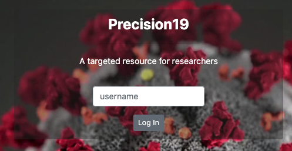
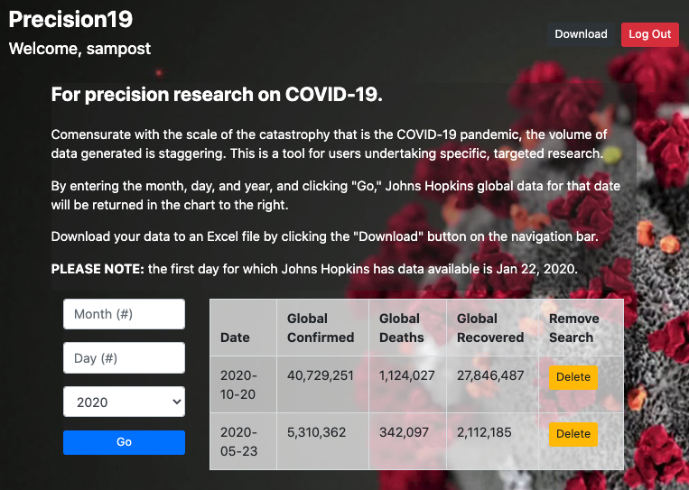

# Precision19 - for targeted research

### Created October, 2020 by Sam Ascheim

## Description

A user interface for global COVID-19 data, by which a researcher can input a date and receive in a table the data for said date (confirmed, recovered, deaths) from Johns Hopkins University.'

UPDATES TO COME:
1. search by date and country interface

## Set-up & Installation requirements

run `npm install` to install dependencies

create a `.env` file and add two keys: the API key and your own MongoDB URI connection

run `npm start` to locally start the program

## Known Bugs

Currently not functional on iOS Safari 

## Support & Contact details

e-mail sam.ascheim@gmail.com for bugs and questions

## Technologies Used

HTML/CSS
JavaScript
React.js (and associated dependencies)
Node.js (and associated dependencies)

## Contribution Guidelines

github: longhike

### License
​
Copyright(c) 2020 by Sam Ascheim
​
This software is licensed under MIT license.

